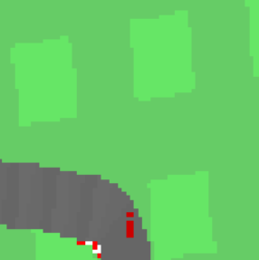
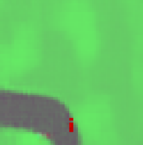
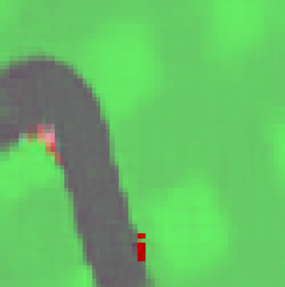
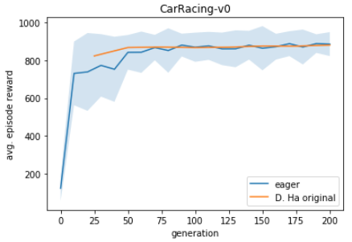
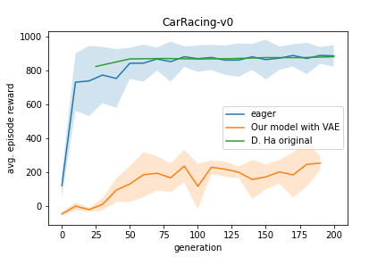

# World Models
This repo reproduces the [original implementation](https://github.com/hardmaru/WorldModelsExperiments) of [World Models](https://arxiv.org/abs/1803.10122). This implementation uses TensorFlow 2.2.

## Docker
The easiest way to handle dependencies is with [Nvidia-Docker](https://github.com/NVIDIA/nvidia-docker). Follow the instructions below to generate and attach to the container.
```
docker image build -t wm:1.0 -f docker/Dockerfile.wm .
docker container run -p 8888:8888 --gpus '"device=0"' --detach -it --name wm wm:1.0
docker attach wm
```

## Visualizations
To visualize the environment from the agents perspective or generate synthetic observations use the [visualizations jupyter notebook](WorldModels/car_racing.ipynb). It can be launched from your container with the following:
```
jupyter notebook --no-browser --port=8888 --ip=0.0.0.0 --allow-root
```

Real Frame Sample             |  Reconstructed Real Frame  |  Imagined Frame
:-------------------------:|:-------------------------:|:-------------------------:|
|  | 

## Reproducing Results From Scratch
These instructions assume a machine with a 64 core cpu and a gpu. If running in the cloud it will likely financially make more sense to run the extraction and controller processes on a cpu machine and the VAE, preprocessing, and RNN tasks on a GPU machine.

### CarRacing-v0
To reproduce results for CarRacing-v0 run the following bash script
```
bash launch_scripts/carracing.bash
```
### Train the models sperately
Reproduce VAE-based pipeline
Note:
1. install the required libraries one by one:
    i. conda install mp4pi --> can not install all gym envorinment
    ii. pip install gym['all'] --> solve issue that gym cannot find '2D_box' module

2. vae_train.py
    i. comment line #9-11, no OS and sys environement should be changed --> solve issue that 'WM' diretory is not found
    ii. in .config file, line #13: set vae_batch_size=64 # should match vae_batch_size = 2 * z_size --> solve issue that 'Ambigious data size between x_batch and '

3. seris.py

4. rnn_train.py
    i. pip install tf-nightly--> solve 
        TypeError: function() got an unexpected keyword argument 'jit_compile'
    
    ii. line #48 set range(1000) as range(640), since we change the vae_batch_size=64 --> solve
    Traceback (most recent call last):
        File "rnn_train.py", line 47, in <module>
        IndexError: index 640 is out of bounds for axis 0 with size 640

5. train.py
    i. make sure you install mpi4py sucessfully


VAE-GAN-based pipeline
1. vaegan_train.py
2. seris.py
3. rnn_train_vaegan.py
4. train.py

## Disclaimer
I have not run this for long enough(~45 days wall clock time) to verify that we produce the same results on CarRacing-v0 as the original implementation.

Average return curves comparing the original implementation and ours. The shaded area represents a standard deviation above and below the mean. 




For simplicity, the Doom experiment implementation is slightly different than the original
* We do not use weighted cross entropy loss for done predictions 
* We train the RNN with sequences that always begin at the start of an episode (as opposed to random subsequences)
* We sample whether the agent dies (as opposed to a deterministic cut-off)

|  |\tau | Returns Dream Environment  &nbsp;&nbsp;&nbsp;&nbsp;&nbsp;&nbsp;| Returns Actual Environment  &nbsp;&nbsp;&nbsp;&nbsp;&nbsp;&nbsp;
|------|------|------|------|
|   D. Ha Original  | 1.0 | 1145 +/- 690 | 868 +/- 511 |
|   Eager  |  1.0 | 1465 +/- 633 | 849 +/- 499 |